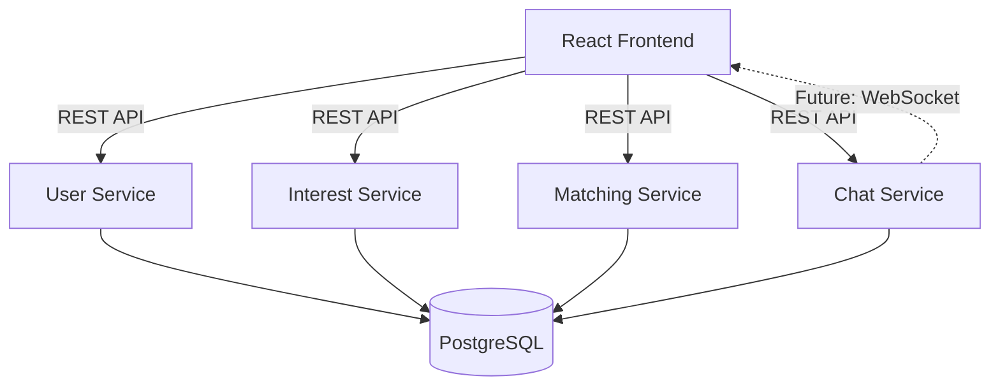
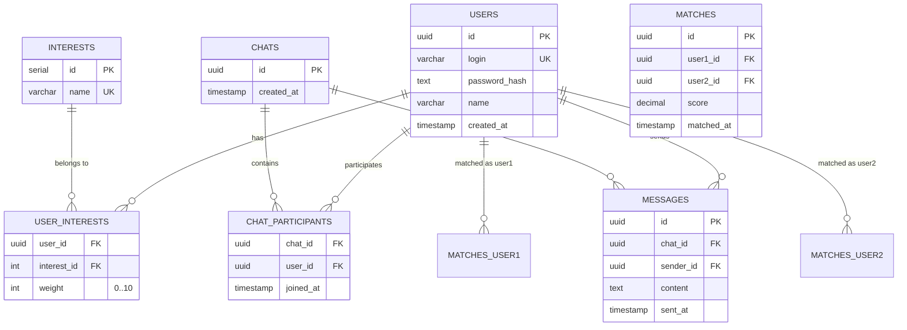

# 💡 Alby — Match Your Interests

Платформа для нетворкинга и знакомств на основе общих интересов.  
Находит людей с похожими увлечениями и помогает начать общение.

## 🎯 Идея проекта

Создать умную систему мэтчинга, которая сравнивает не просто «любишь ли ты кино», а насколько сильно (по шкале 0–10).  
Алгоритм находит пересечения по всем интересам и выдает самый подходящий мэтч.

После нахождения пары создаётся общий чат, и пользователи могут сразу начать диалог — всё в одном приложении.

## 🧱 Архитектура

Проект построен на микросервисной архитектуре (модульный монолит) с разделением на слои.  
Используется **Event-Driven** подход для будущего масштабирования (на данном этапе — асинхронное взаимодействие через REST).



## 🛠 Технологический стек

### Backend
- **Java 21**
- **Spring Boot 3.x** (Web, Data JPA, Validation, WebSocket)
- **PostgreSQL 16** (основная БД)
- **Docker** (контейнеризация БД)
- **Maven** (сборка)

### Frontend
- **React 19** + **TypeScript**
- **Vite** (сборщик)

## 📦 Схема базы данных



## 🚀 Быстрый старт

### 1. Клонирование репозитория

```bash
git clone https://github.com/abazarov502/alby.git
cd alby
```

### 2. Запуск базы данных (Docker)

```bash
cd backend
docker compose up -d
```

БД будет доступна на порту **5433** (логин: `albyuser`, пароль: `albypass`).

### 3. Запуск бэкенда

```bash
cd backend
./mvnw spring-boot:run
```

При первом запуске автоматически создадутся таблицы (из `schema.sql`) и заполнится справочник интересов.

Бэкенд будет доступен на `http://localhost:8080`.

### 4. Запуск фронтенда

```bash
cd frontend
npm run dev
```

Фронтенд будет доступен на `http://localhost:5173`.

## 📡 API Endpoints

| Метод | Путь | Описание |
|-------|------|----------|
| POST | `/api/users/register` | Регистрация пользователя с интересами |
| GET | `/api/users` | Список всех пользователей |
| GET | `/api/interests` | Справочник интересов |
| GET | `/api/matches?userId=UUID` | Поиск совпадений по интересам |
| POST | `/api/chats` | Создание чата между двумя пользователями |
| GET | `/api/chats?userId=UUID` | Чаты пользователя |
| GET | `/api/chats/{chatId}/messages` | История сообщений |
| POST | `/api/chats/{chatId}/messages` | Отправить сообщение |

## 🧪 Алгоритм мэтчинга

Для выбранного пользователя ищутся все остальные и считается **сумма совпадений** по интересам:

```
score = SUM( MIN(weight_пользователя, weight_другого) ) для всех общих интересов
```

Результат сортируется по убыванию `score`.  
Чат можно создать только с пользователем, занявшим **первое место** в списке.

## 📈 Планы по развитию

- [ ] WebSocket-чат (real-time сообщения)
- [ ] Unit и Integration тесты (JUnit, Testcontainers)
- [ ] Деплой на Render / Fly.io
- [ ] CI/CD через GitHub Actions
- [ ] Графовая БД Neo4j для продвинутого мэтчинга

## 📄 Лицензия

MIT
```